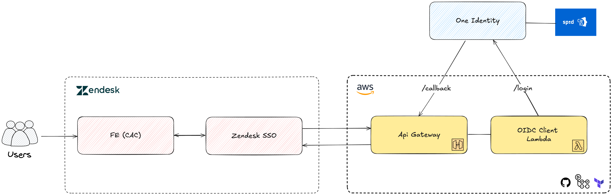
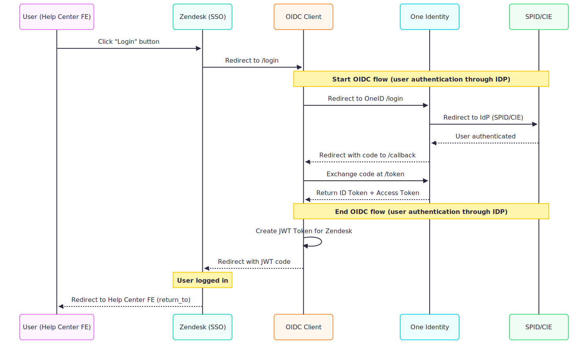

# as-help-center-oidc-client

1. [What is?](#what-is)
2. [Architecture](#architecture)
   - [Main technologies used](#main-technologies-used)
3. [Getting Started](#getting-started)
   - [Prerequisites](#prerequisites)
   - [Installation](#installation)
   - [Configuration](#configuration)
   - [Run the application](#run-the-application)
   - [Available scripts](#available-scripts)
4. [Contributing](#contributing)

## What is?

This project implements an OpenID Connect (OIDC) client to handle authentication and authorization between the [PagoPA Help Center (CAC)](https://github.com/pagopa/as-help-center) and [One Identity](https://github.com/pagopa/oneidentity).

## Architecture


\
<br/>


**CI/CD pipeline**\
The project is managed via a CI/CD pipeline that ensures code integrity and efficient deployment. Key features include: code validation for every pull request, automatic deployment and infrastructure update (IaC).

### Main technologies used

- Express
- Typescript
- Dotenv
- ZOD
- Jest
- OpenID Connect Client
- AWS
- Github Actions
- Terraform

## Getting started

### Prerequisites

- Node and npm (the node version is stored in the `.nvmrc` file, we recommend to use [nvm](https://github.com/nvm-sh/nvm) to quickly install and use different versions of node)

### Installation

1. Clone the repository:
   ```bash
   git clone <REPOSITORY_URL>
   ```
2. Install and use node version defined in the .nvmrc file:
   ```bash
   nvm install && nvm use
   ```
3. Install dependencies:
   ```bash
   npm install
   ```

### Configuration

1. Create a `.env` file in the root of the project. You can duplicate the `.env.example` and rename it to `.env`.
2. Fill in the `.env` file with the required environment variables.

### Run the application

To run in development mode (local):

```bash
npm run dev
```

To compile and run in production mode:

```bash
npm run build
npm start
```

### Available scripts

- `npm run build`: Compiles the TypeScript code into JavaScript.
- `npm start`: Starts the compiled application.
- `npm run dev`: Starts the application in development mode using `nodemon`.
- `npm run test`: Run all unit tests in the "tests/" directory, generating code coverage reports
- `npm run type-check`: Runs TypeScript type checking.
- `lint`: Runs eslint checks,
- `lint:fix`: Run eslint and fix all errors,
- `format`: Runs prettier to format files

\
<br/>

## Contributing

We use [conventional commits](https://conventionalcommits.org/) to improve readability of the project history and to automate the release process. The commit message should therefore respect the following format:

```
<type>[optional scope/task]: <description>

[optional body]

[optional footer(s)]
```

- type: describes the category of the change. See [supported types](docs/extendings/commit-types.md).
- scope/task: (optional) describes what is affected by the change
- description: a small description of the change
- body: (optional) additional contextual information about the change
- footer: (optional) adds external links, references and other meta-information

i.e.:

```
chore: automate release
fix(routes): fix auth route path
feat(CACI-101): add zod validation
```

We use [husky](https://github.com/typicode/husky) and [commitlint](https://github.com/conventional-changelog/commitlint) to validate messages when commiting.

We use [Github actions](https://github.com/features/actions) together with [semantic-release](https://github.com/semantic-release/semantic-release) to release a new version once a PR gets merged into main branch. To achieve this, there is also a check for the [Branch and Pull Request name](docs/extendings/branch-pr-name.md)
